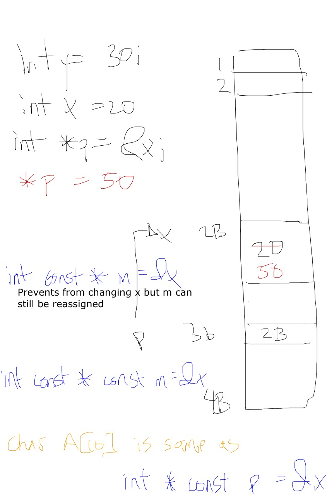
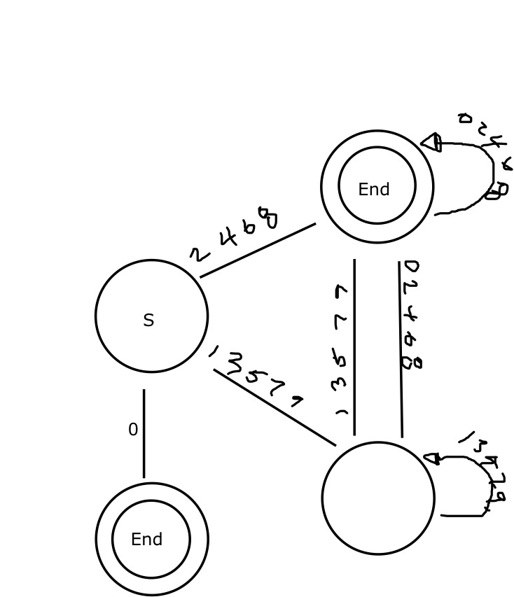
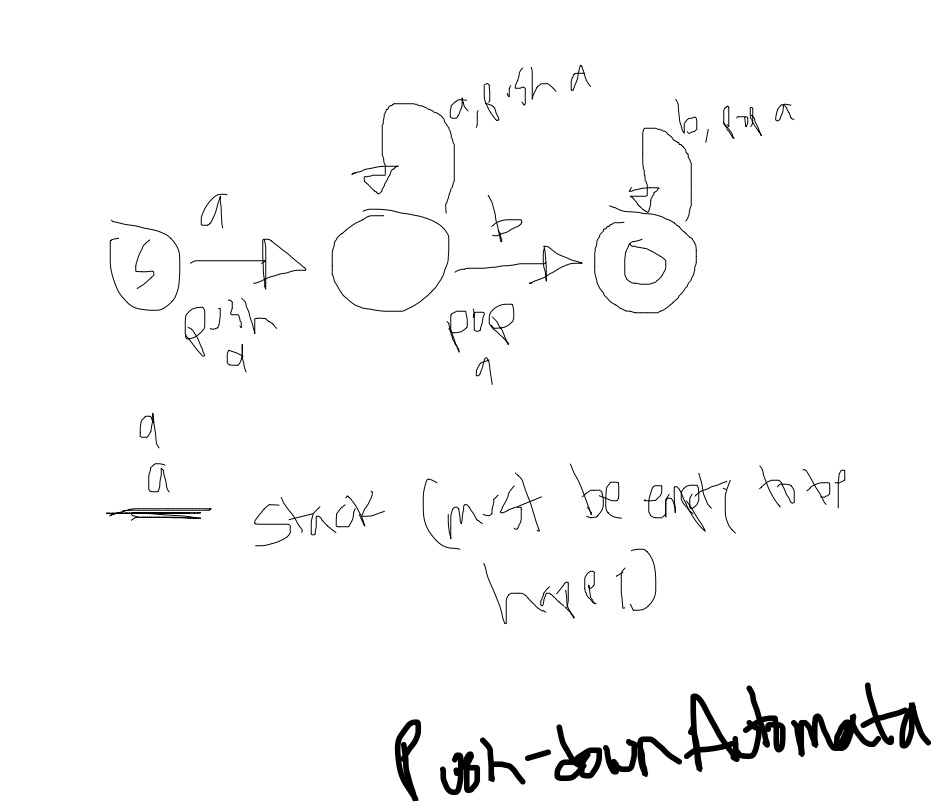
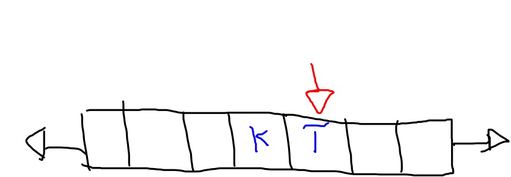
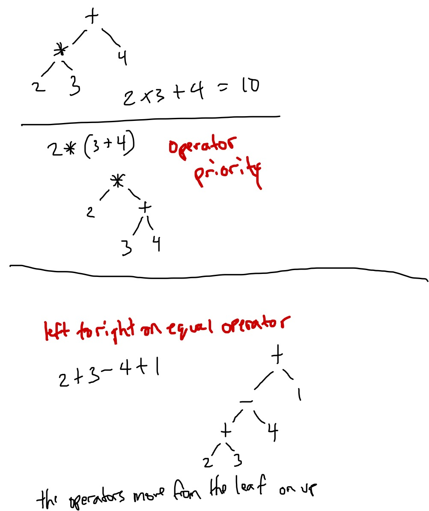

# CS 4550 - Compilers

* [Course Website](http://cit.dixie.edu/cs/4550/)
* 2:00pm - 3:40pm MW in Hazy 119


## Mon Jan 12

Notes for this day were lost due to my own stupidity. We reviewed c++ and how
it compared to c.

Highlights (that I can remember):

* c++ methods are non-virtual by default
* if you want an overriden method to be called it needs to be virtual. Consider
the following:

```c++
class Shape {
  virtual void Draw();
  virtual int NumSides() = 0; // purely virtual
}

class Circle {
  void Draw();
  int NumSides();
}

int main() {
  std::vector<Shape *> shapes;
  for (shape in shapes) {
    shape->Draw()
  }
  return 0;
}

// if one of the shapes is a Circle, the Circle's Draw method will
// only get called if the Draw method is declared as virtual
```

## Wed Jan 14

### C++ Initializations

```c++
class A {
public:
  A(int xx) : x(xx) {
    cout << "A constructor" << endl;
  }

  // 1
  virtual ~A() {
    cout << "A destructor" << endl;
  }

  virtual void Draw() {
    cout << "Drawing.." << endl;
  }
private:
  int x;
};

class B : public A {
public:
  B(int xx, int yy) : y(yy), A(xx) {
    cout << "B constructor" << endl;
  }
  ~B() {
    cout << "B destructor" << endl;
  }

  void Draw() {
    cout << "Also drawing.." << endl;
    A::Draw(); // 2
  }
private:
  int y;
}
```

1. base class destructors should almost always be virtual
2. this is how you call a parent's method

* constructors and destructors automatically call their parents
* **avoid dynamic memory unless you really need it**. If you know you're always
going to have 1 of something, don't store it as a pointer.

#### robust example

How to make a class with dynamic memory robust?

1. destructor
  * any `new` you have needs a corresponding `delete`
  * any _newables_ need to be set to `NULL` in the constructor
2. copy constructor (skipped in class)
3. assignment operator (skipped in class)

```c++
class robust {
public:
  robust() {
    x = NULL;
  }
  ~robust() {
    if (x) {
      delete []x;
    }
  }

  void SetSize(int num) {
    // release any old memory
    if (x) {
      delete []x;
      x = NULL;
    }

    if (num <= 0)
      return;

    // allocate any new memory
    x = new int[num];
  }

private:
  int *x; // 1
};

int main() {
  cout << "How many integers do you really need? ";
  int num;
  cin >> num;
  robust r;
  r.SetSize(num);

  return 0;
}
```

1. dynamically allocating memory because we don't know how many `x`s we are going
to have. This is opposed to doing `int x[n]` because we don't know `n`.

### Pointers

Size | Type
---- | ----
1 | char
2 | short int
4 | long int
4 | int
8 | int
4 | float
8 | double

* pointers to each type are their own types (`char *`, `int *`, etc)



Before we could pass by reference there was this (which is what pass by reference
does behind the scenes):

```c++
void Foo(int *x) {
  *x = *x+1;
}

int x = 5;
Foo(x);
cout << "x = " << x; // x = 6
```

example | when to use
------  | ------
`void Foo(Student const &x)` | when you don't want it changed and it's a big type
`void Foo(int &x)` | you don't want to copy
`void Foo(int x)` | you don't mind copying (keep cost in mind)


## Wed Jan 21

### Chapter 1

Term | Definition
---- | ---------
alphabet | a set of characters
string | arrangement of characters in an alphabet
language | subset of all possible strings (because possible strings is infinite)
formal vs natural language | whether legality is clear. natural languages are vague
grammar | a tool that generates the legal strings of some language
terminals | ending points
nonterminals | variables
start symbol | symbol we start with
derivation | all the steps within a grammar (see grammar section below)
machine | flip side of a grammar - given a string, test if it is legal
undecidables | problems the Turing Machine can't solve

#### Grammar

A good grammar can generate exactly the right amount of legal strings.

Examples:
* `S -> P -> 5`
* `S -> PN -> 7ND -> 7DD -> 704`

machine | grammar category
------- | -----------
finite automata | restricted
push-down automata | context free
turing maching | unrestricted

##### Grammar Categories

###### Restricted
Grammars can be written in a _restricted form_. **We don't have to do this for
our homework.**

* `X -> a | aY` or
* `S -> ~`

symbol | description
------ | ----------
X, Y | nonterminal
a | terminal
S | start nonterminal
~ | nothing

_Bart will use capital letters for nonterminals and lowercase for terminals._

###### Context free
* `X -> anything`

###### Unrestricted

* `anything -> anything`

To solve `AnBnCn` we need multiple things on the left (ie `aXY -> bXyz`) google it.

#### Machine

A machine tests if strings are legal

* finite automata
* push-down automata
* turing machine

##### Even Numbers

`S -> E | PE | PNE`

* `S`: start symbol
* `E`: single digit, must be even
* `PE`: two digits, `P` can't be zero, `E` must be even
* `PNE`: two or more digits. `N` means we allow zeros in the middle



##### Finite Automata
Used to test state. Finite automata machines are _finite_ in that they are limited
to how many states they can support. `A^nB^n` is one such an example that a finite
automata machine can not support.

##### Push-down Automata
Uses a stack to support more states than a finite automata could.

* also limited in power (`A^nB^nC^n`)
* need a Turing Machine to go further



##### Turing Machine

1. starts with a Push-down automata
2. replace infinite stack with an infinite tape
3. write any character to the current cell on the tape
4. decision process is based on reading and writing the tape

**Proved that any computation a computer can do, so can the infinite tape.**

Not only can it test `A^nB^nC^n` but it can compute _anything_.

**Undecidables** are problems that the Turing Machine can't solve.



#### Homework
* we don't have to type solutions
* 2 is just plugging in the tests to see if they pass. if they pass write a derivation for each letter
* 3 grammars that are of the 2nd level of hardness
* 4 _What is the level?_ if you can make a finite automata machine then it is level 1,
otherwise it is context free or worse.
* 4 should say _classify the language_


## Mon Jan 26

### Announcements
* New office hours, see course website

### Homework Questions
* allow or disallow empty string per problem but be consistent!
* 1G is only lowercase letters
* 3A:
  * `S -> aSa | bSb | ... | zSz | a | b | c | ... | (nothing)
* 1A:
  * first draw path to success
* G: don't bail when you're halfway there
* **DUE WEDNESDAY**

### Chapter 2 - The Scanner

#### Problems

* when you choke on a character put it back in the input stream


## Wed Jan 28

Went over assignment 1 questions.


## Mon Feb 2

Working on Assignment 2

### A2 Question 3 - State Machine
 * this will be a simulator for any finite automata

 ```cpp
 MachineState mLegalMoves[LAST_STATE][LAST_CHAR]
 ```

language | S | A | B
------ | -- | --- | --
x | A | A | S
y | S | A | B
z | S | B | CANT_MOVE

Start by setting them all to `CANT_MOVE` then go back and fill out the legal edges.

This array ties token types and states:
```cpp
TokenType mCorrespondingTokenTypes[LAST_STATE]
```
Initialize it with `BAD_TOKEN` Token Types.
Not all machine states have a corresponding token type.


## Wed Feb 18

### Agenda
* Scanner questions
* Symbol Table
* Parse tree

### Scanner Questions
10: need to add NOT_EQUAL support

### Symbol Table
Job is to keep track of all the variables as a list. A variable will be a `struct`
with two fields:
* label: string
* value: int

Problems at the end of the chapter explain how to create the `Symbol` and `SymbolTable`
classes.

### Parse Tree
* build tree by expanding nonterminals, terminals don't have children
* terminals should be verified then forgotten
* store lexeme inside of IdentifierNode and IntegerNode and point to the symbol table.
* StatementGroup should have a vector of Statement pointers

Class hierarchy- stick all the heads in `Node.h`.

* Node
  * StartNode
  * ProgramNode
  * StatementNode
    * DeclarationStatement
    * AssignmentStatement
    * CoutStatement
  * ExpressionNode
    * IntegerNode
    * BinaryOperatorNode
      * Plus Node
      * 9 others
  * etc.


## Wed Jan 25

### Agenda
* Chapter 5 - Expressions
* A little bit of Chapter 6

Chapter 6 uses the grammar rules from chapter 5 but makes them not _left recursive_.
He is considering just doing it all in chapter 5.

### Expressions
We discussed the Plus Node in chapter 4, now we need to add the rest of the
`ExpressionNode`s.

We want grammar rules that enforce:
* operator priority
* left to right on equal priority
* parens - to force order
* no _left recursion_

#### How a parse tree is evaluated

The tree is evaluated from bottom to top.

##### operator priority
Split the operators into levels (lowest to highest):

1. FACTOR = `> >= < <= == !=`
2. PLUS_MINUS = `+ -`
3. TIMES_DIVIDE = `\* /`

##### left to right on equal priority
This is what we had last time...
```
2 + 3 - 4 + 1
<Expression> -> <Expression> PLUS <Expression> | <Expression MINUS <Expression>
```

But it doesn't actually work because we **must** expand the left `<Expression>`
first so that we build the tree down the left side and not the right.

#### "From the top!"
```
ITEM = integer, identifier, etc
PLUS_MINUS = + - level
TIMES_DIVIDE = * / level

<Expression> -> <Relational>
<Relational> -> <PLUS_MINUS><RelOperator><PLUS_MINUS> | <PLUS_MINUS>
<RelOperator> -> EQUAL | NOTEQUAL | LESS | LESSEQUAL | GREATER | GREATEREQUAL
<PLUS_MINUS> -> <PLUS_MINUS>PLUS<TIMES_DIVIDE> | <TIMES_DIVIDE>
<PLUS_MINUS> -> <PLUS_MINUS>MINUS<TIMES_DIVIDE> | <TIMES_DIVIDE>
<TIMES_DIVIDE> -> <TIMES_DIVIDE>TIMES<ITEM> | <ITEM>
<TIMES_DIVIDE> -> <TIMES_DIVIDE>DIVIDE<ITEM> | <ITEM>
<ITEM> -> <Identifier> | <Integer> | (<Expression>)
<Identifier> -> IDENTIFIER
<Integer> -> INTEGER

✓ operator priority
✓ left to right on equal priority
✓ parens
```

* Each grammar rule will be a method on `Parser`.
* At each level I can go to the level below it, directly or I can do left tree
expansion.
* the parens around the `<Expression>` at the end there is all we need to support
parens.
* this gets us 3 out of the 4 requirements for expressions.

##### Discussion

Expressions only have 1 relational operator so we want to support multiple times
and divides but only zero or one relational operators so we changed it:

**Before:**
```
<Relational> -> <Relational><RelOperator><PLUS_MINUS> | <PLUS_MINUS>
```

**After:**
```
<Relational> -> <PLUS_MINUS><RelOperator><PLUS_MINUS> | <PLUS_MINUS>
```

#### Fixing left recursion

Sample expressions:
```
3 * 4 / 7
6
```

This is a problem:
```
<TIMES_DIVIDE> -> <TIMES_DIVIDE>TIMES<ITEM> | <ITEM>
<TIMES_DIVIDE> -> <TIMES_DIVIDE>DIVIDE<ITEM> | <ITEM>
```
because we will get an infinite loop so it becomes more like:
```
<Term> -> <Factor><FactorTail>
<FactorTail> -> {empty}
<FactorTail> -> TIMES<Factor><FactorTail>
<FactorTail> -> DIVIDE<Factor><FactorTail>
```
This is achieved by peeking to see if we have more times and divides to take. If
there aren't any then you can return to the level above.


## Mon Mar 2

* Work day


## Wed Mar 4

### Agenda
* Questions
* Chapter 6

### Chapter 6 - writing your own parser

This is divided in to 2 main sections, with no output and with output.

#### No Output

* terminals are functions, nonterminals use `Match`

StatementGroups are tricky because there can be any number of statements. Peek ahead
and use `seekq()` to set it back to where it was.

Call `GetNextToken()` from `PeekNextToken()`.

The end of the parse code should return a pointer to the root node (which you should
be able to call `delete` on and every node will get deleted).

Make sure all nodes can print a message on construction and destruction.


## Mon Mar 16

* Get Parser (chapter 6) done by Wed


## Wed Mar 18

### Announcements

* Parser (Chapter 6) should be done.

### The Interpreter

The chapter is pretty descriptive. We are having each node interpret themselves.
